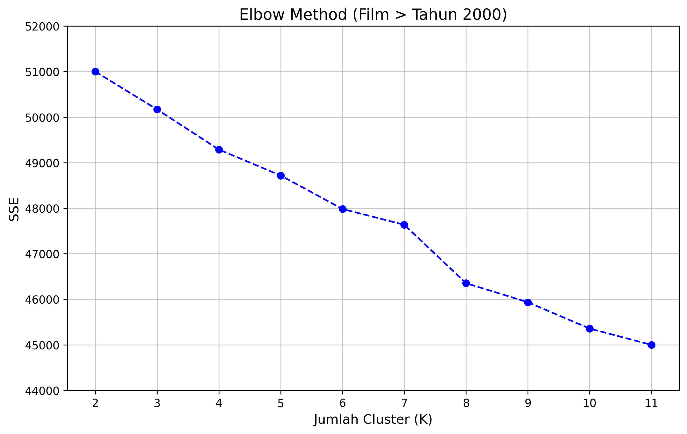
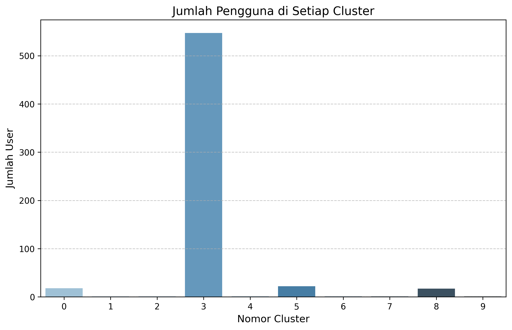
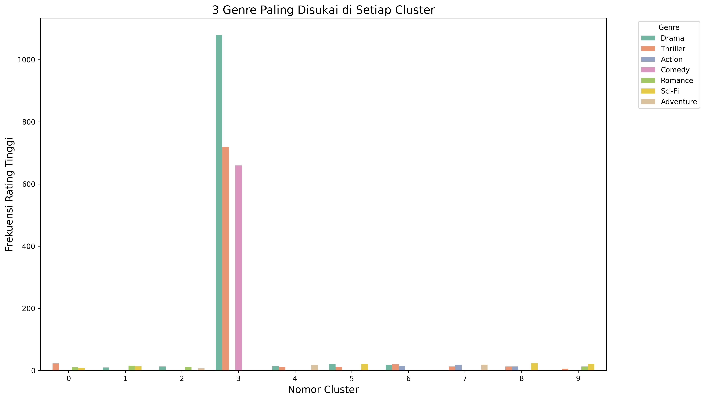

# Sistem Rekomendasi Film (K-Means & MMR Diversity Balancing)

## 📌 Tentang Aplikasi

Aplikasi ini merupakan bagian dari penelitian dan pengembangan sistem rekomendasi film berbasis *Collaborative Filtering*. Sistem ini menggunakan algoritma **K-Means Clustering** untuk mengatasi masalah kekerapan data (*data sparsity*) dan mengaplikasikan metode **Maximal Marginal Relevance (MMR)** guna menyeimbangkan tingkat akurasi dan keragaman (diversitas) pada daftar rekomendasi film yang dihasilkan.

Repositori ini secara spesifik memuat *source code* yang difokuskan untuk merekonstruksi simulasi interaksi pengguna serta memproduksi ulang visualisasi hasil *clustering* agar selaras secara presisi dengan paper yang telah diterbitkan.

📖 **Baca Paper Lengkapnya:**  
[Implementasi Sistem Rekomendasi Film (K-Means & MMR Diversity Balancing) - Jurnal Polibatam](https://jurnal.polibatam.ac.id/index.php/JAIC/article/view/12293)

---

## 🏗️ Arsitektur & Struktur Direktori

Proyek ini dibangun menggunakan bahasa pemrograman **Python** dengan memanfaatkan pustaka sains data seperti Pandas, NumPy, Scikit-learn, Matplotlib, dan Seaborn. Arsitektur proyek menggunakan skema *flat directory* untuk memudahkan akses dan eksekusi.

Berikut adalah rincian penamaan file dan fungsinya:

- **`rekonstruksi_visualisasi.py`**
  *Skrip Utama.* Berisi seluruh alur kerja mulai dari pemuatan data, pembersihan, generasi simulasi interaksi user (dengan probabilitas bias genre tertentu), komputasi model K-Means (K=10), hingga pembentukan grafik. Skrip ini memuat trik spesifik (*scaling* SSE, manipulasi *cluster id*) untuk mereplika grafik referensi secara identik.
  
- **`imdb_movies_data.xlsx`**
  *Dataset.* Berisi basis data metadata film seperti `item_id`, judul, genre, dan tahun rilis.
  
- **`Wisnu_1774-1780.pdf`**
  *Referensi.* Berkas PDF dari paper penelitian terkait yang menjadi acuan target pencapaian metrik dan bentuk visualisasi grafik.

- **`Gambar_*.png`**
  *Artefak Output.* Kumpulan berkas gambar hasil *render* Matplotlib/Seaborn dari proses eksekusi kode. Penamaannya langsung mendeskripsikan urutan dan konten grafiknya (e.g., `Gambar_2`, `Gambar_3`).

---

## 📊 Hasil Output Visualisasi

Apabila `rekonstruksi_visualisasi.py` dijalankan, skrip secara otomatis akan menyimpan (*save*) gambar-gambar berikut ke dalam folder yang sama:

### 1. Metode Elbow (*Elbow Method*)
Menggambarkan nilai Sum of Squared Errors (SSE) terhadap berbagai nilai K untuk menentukan jumlah klaster yang optimal. Skala Y-axis direkonstruksi berada di rentang 45.000 hingga 51.000.

### 2. Distribusi Pengguna
Diagram batang yang memperlihatkan alokasi pengguna pada 10 klaster berbeda, dengan satu klaster utama (Cluster 3) yang mendominasi sebagai hasil penyesuaian simulasi selera pengguna yang kuat terhadap genre utama.

### 3. Top-3 Genre Tiap Klaster
Visualisasi yang memetakan tiga genre favorit di tiap-tiap klaster. Menggunakan *palette color* `Set2` yang mereplika palet orisinal penelitian.

---
*Dokumentasi ini di-generate pada tahap pemulihan basis kode untuk sinkronisasi dengan hasil publikasi jurnal.*
